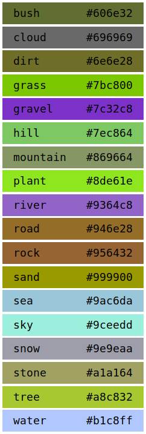

# GauGAN plugin for GIMP

By using this plugin you agree to NVIDIA RESEARCH AI PLAYGROUND [TERMS OF USE](http://34.220.80.140/gaugan/term.txt)!

 

## Installation

Put the `gaugan.py` script into the GIMP plug-ins folder (create the folder if it does not exist):

* macOS: `$HOME/Library/Application Support/GIMP/2.10/plug-ins`
* Windows: `$HOME/AppData/Roaming/GIMP/2.10/plug-ins`
* Linux: `$HOME/.config/GIMP/2.10/plug-ins`

## Usage

1. This plugin only works with 512x512 RGB images.
2. The image can only contain colors from the GauGAN palette. See the files `palette.html` or `palette.png` for details.
3. Use `Filters > GauGAN` menu item to process the segmentation map you created (the selected layer will be processed).
4. You can use the following values as `style` parameter: `random`, `0`, `1`, ... , `8`, `9`, `10`.

## Palette

## Original Demo

The original Live Interactive Demo is available from [NVIDIA AI Playground](https://www.nvidia.com/en-us/research/ai-playground/).
